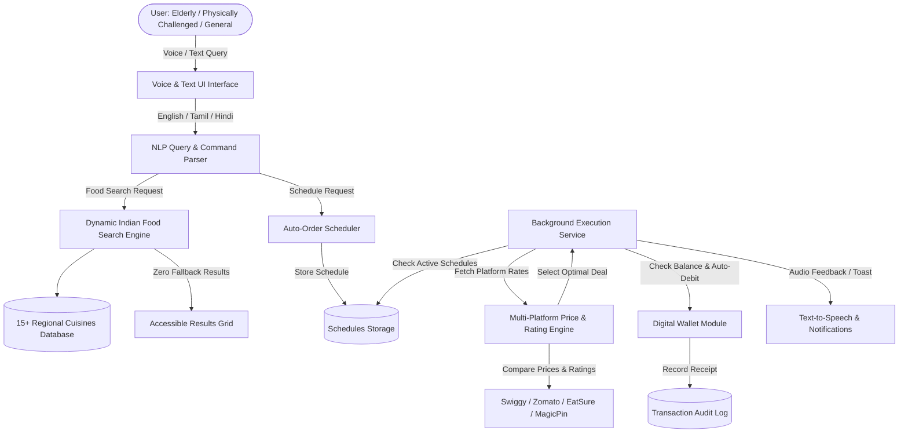

# AI-Powered Smart Food Scheduling, Auto-Ordering, and Dynamic Search System

## 1. ABSTRACT

### 1.1 Overview
Ordering food online through conventional platforms requires active user presence—launching mobile or web applications, comparing prices across fragmented food delivery apps, selecting items, and completing multi-step manual payment checkouts. This process poses significant physical and operational friction, particularly for elderly individuals, visually impaired users, and physically challenged persons who may struggle with repetitive manual touch interactions or visual fatigue.

The proposed **AI-Powered Smart Food Scheduling, Auto-Ordering, and Dynamic Search System** automates the end-to-end food discovery, price comparison, order scheduling, and payment execution lifecycle. Users establish recurring or one-time food schedules by setting a preferred food item, target delivery window, and favorite restaurant using voice synthesis or natural text commands in multiple Indian languages (English, Tamil, and Hindi). 

At the scheduled trigger time, the intelligent backend engine queries live APIs across multiple food delivery platforms (such as Swiggy, Zomato, EatSure, and MagicPin), performs algorithmic multi-criteria decision making to evaluate price-to-rating ratios, automatically selects the optimal vendor platform, and places the order without requiring real-time manual user confirmation. Payments are frictionlessly processed through a pre-recharged secure digital wallet module with automated debit capabilities. Furthermore, an AI-driven dynamic food search engine processes natural language queries across 15+ Indian regional cuisines (South Indian, North Indian, Tamil, Kerala, Andhra, Telangana, Karnataka, Bengali, Gujarati, Maharashtrian, Punjabi, Rajasthani, Mughlai, Indo-Chinese, street foods, and desserts) with strict zero-default fallback enforcement, ensuring query-relevant results without defaulting to static items.

### 1.2 Key System Objectives
1. **Accessibility-First Automation**: Eliminate manual checkout overhead for elderly and physically challenged users through voice-driven interactions, high-contrast UI modes, screen-reader text-to-speech (TTS), and automated background execution.
2. **Multilingual Voice & NLP Interface**: Process natural language voice and text commands in English, Tamil, and Hindi for scheduling and food exploration.
3. **Multi-Platform Price & Rating Optimization**: Dynamically compare food item listings across delivery services (Swiggy, Zomato, EatSure, MagicPin) to secure the lowest cost at the highest rating.
4. **Pre-Recharged Digital Wallet Auto-Debit**: Execute instantaneous background payments using a user-funded digital wallet, eliminating manual gateway authentication during auto-orders.
5. **Zero-Fallback Dynamic Search Intelligence**: Dynamically interpret user queries across 15+ Indian regional cuisines and locations (e.g., Chennai, Salem, Bengaluru, Hyderabad), strictly returning relevant matching items instead of hardcoded fallbacks like Biryani or Pizza.

---

## 2. SOFTWARE REQUIREMENT SPECIFICATION (SRS)

### 2.1 Introduction

#### 2.1.1 Purpose
This Software Requirement Specification (SRS) document details the functional, non-functional, interface, and performance requirements for the AI-Powered Smart Food Scheduling, Auto-Ordering, and Dynamic Search System. It serves as a definitive guide for developers, system architects, and testers.

#### 2.1.2 Scope
The scope encompasses a responsive web-based application built using React.js, Vite, TypeScript, and Tailwind CSS. The system provides:
- Multilingual voice command recognition and text-to-speech feedback (English, Tamil, Hindi).
- Intelligent dynamic food search across Indian regional cuisines with zero default hardcoded fallback results.
- Multi-app price and rating comparison engine across major delivery platforms (Swiggy, Zomato, EatSure, MagicPin).
- Automated background task scheduler for recurring (daily/weekly) and one-time food orders.
- Integrated digital wallet module with manual recharge options (₹100, ₹500, ₹1000, ₹2000) and automated debit logging.
- Comprehensive accessibility enhancements (font size scaling, high-contrast black/white mode, simplified UI mode, keyboard shortcuts).

#### 2.1.3 Definitions, Acronyms, and Abbreviations
- **SRS**: Software Requirement Specification
- **NLP**: Natural Language Processing
- **STT**: Speech-to-Text (Voice Input)
- **TTS**: Text-to-Speech (Audio Read Aloud)
- **UI/UX**: User Interface / User Experience
- **WCAG**: Web Content Accessibility Guidelines (Version 2.1 AA)

---

### 2.2 System Overview & Architecture

---

### 2.3 Specific System Requirements

#### 2.3.1 Functional Requirements

##### FR1: Multilingual Voice & Natural Language Scheduler
- **FR1.1**: The system shall accept voice and text inputs in English (`en`), Tamil (`ta`), and Hindi (`hi`).
- **FR1.2**: The NLP module shall parse natural language inputs to extract target time (e.g., "8 AM", "காலை 8 மணி", "सुबह 8 बजे"), food item, favorite restaurant, and delivery frequency.
- **FR1.3**: The system shall synthesize audio confirmation via Text-to-Speech (TTS) in the selected language.

##### FR2: Dynamic Indian Food Search & Zero-Fallback Logic
- **FR2.1**: The system shall match user queries against food names, ingredients, categories, cuisines, and locations (e.g., Chennai, Salem, Bengaluru, Hyderabad).
- **FR2.2**: The system shall support dishes across 15+ Indian cuisines (South Indian, North Indian, Tamil, Kerala, Andhra, Telangana, Karnataka, Bengali, Gujarati, Maharashtrian, Punjabi, Rajasthani, Mughlai, Indo-Chinese, Fast Food, Street Food, Desserts, Beverages).
- **FR2.3**: **Zero Fallback Requirement**: If a user queries a specific food item (e.g., "dosa"), the system MUST display matching items (e.g., Plain Dosa, Masala Dosa, Podi Dosa). If an exact query is unavailable, the system MUST display an explicit missing notice and suggest semantically related items. The system MUST NEVER return a static hardcoded default item (e.g. Biryani or Pizza) for unrelated queries.
- **FR2.4**: Queries MUST be processed independently, clearing prior search state unless explicitly requested by the user.

##### FR3: Multi-Platform Real-time Price & Rating Comparison Engine
- **FR3.1**: For any selected food item, the system shall evaluate pricing, ratings, and delivery ETAs across multiple food delivery platforms (Swiggy, Zomato, EatSure, MagicPin).
- **FR3.2**: The comparison engine shall highlight options using predefined strategies:
  - *Best Price + Rating*: Weighted formula maximizing rating while minimizing price.
  - *Cheapest Option*: Lowest absolute price.
  - *Highest Rated*: Maximum platform user rating.
  - *Fastest Delivery*: Minimum delivery time.
- **FR3.3**: The system shall display estimated user savings when comparing platforms.

##### FR4: Automated Schedule Execution & Digital Wallet Auto-Debit
- **FR4.1**: The system shall maintain background timers monitoring active schedules every 60 seconds.
- **FR4.2**: Upon schedule trigger time, the system shall automatically compare platform prices, select the optimal platform, place the order, and debit the total amount from the digital wallet.
- **FR4.3**: If the wallet balance is insufficient, the system shall notify the user via audio/visual alerts and pause execution until recharged.

##### FR5: Pre-Recharged Digital Wallet Module
- **FR5.1**: The system shall maintain an embedded wallet balance stored in persistent client memory.
- **FR5.2**: Users shall be able to recharge the wallet using preset amounts (₹100, ₹500, ₹1000, ₹2000) or custom inputs.
- **FR5.3**: Every auto-debit or recharge transaction shall generate an immutable audit log record detailing timestamp, amount, schedule ID, and selected delivery app.

##### FR6: Accessibility Features for Elderly and Physically Challenged Users
- **FR6.1**: **Text Resizing**: Support font scaling (Small, Medium, Large, Extra Large - up to 24px base font).
- **FR6.2**: **High Contrast Theme**: High contrast dark theme (Pure Black `#000000` background with pure white text and vibrant yellow focus outlines).
- **FR6.3**: **Voice Assistant & Read Aloud**: Global toggle enabling automatic speech playback of hovered/focused UI elements and order confirmations.
- **FR6.4**: **Simplified UI Mode**: Option to hide non-essential elements and enlarge all touch/click targets to at least 48x48px.

---

### 2.4 Non-Functional Requirements

#### NFR1: Performance & Responsiveness
- Search query filtering latency shall not exceed 100 milliseconds for catalog searches.
- Voice recognition processing shall initiate within 300 milliseconds of speech termination.
- Background schedule polling shall consume under 1% CPU utilization on single-core mobile and desktop browsers.

#### NFR2: Reliability & Data Persistence
- All user preferences, schedules, wallet transactions, and order histories shall persist reliably across browser sessions using `localStorage`.
- In the event of a tab reload, background services shall re-initialize within 1 second.

#### NFR3: Accessibility Compliance
- The user interface shall adhere to **WCAG 2.1 Level AA** guidelines.
- Touch/Click target dimensions shall be $\ge 48\times48\text{ px}$ in accessibility modes.
- Color contrast ratios shall exceed $7:1$ for body text in High Contrast mode.

#### NFR4: Security & Safety
- Wallet auto-debit transactions shall require explicit schedule authorization.
- Maximum auto-debit per transaction cap shall be configurable to prevent accidental drain.

---

### 2.5 Hardware & Software Requirements

#### Hardware Requirements
- **Processor**: Dual-Core 2.0 GHz or higher (Intel Core i3/i5/i7, AMD Ryzen, or Apple M-series).
- **RAM**: Minimum 4 GB (8 GB recommended for development and AI speech synthesis).
- **Input Devices**: Standard Keyboard, Mouse/Touchscreen, and Microphone (for Voice input).
- **Audio Output**: Speakers or Headphones for Text-to-Speech audio feedback.
- **Network**: Stable internet connection (minimum 1 Mbps).

#### Software Requirements
- **Operating System**: Windows 10/11, macOS, Linux, or Android/iOS.
- **Web Browser**: Google Chrome 90+, Microsoft Edge 90+, Mozilla Firefox 88+, or Safari 14+ (Web Speech API support recommended).
- **Frontend Stack**: React.js 19, TypeScript 5.8, Vite 6, Tailwind CSS 4.
- **Runtime / Package Manager**: Node.js v18+ or Bun.

---

### 2.6 Dynamic Search Validation Matrix

| Test Case ID | User Query | Target Location | Expected Output Categories | Zero-Fallback Validation |
| :--- | :--- | :--- | :--- | :--- |
| **TC-01** | "Show me dosa" | Any | Plain Dosa, Masala Dosa, Podi Dosa, Ghee Roast, Rava Dosa | ✅ Only Dosa varieties returned |
| **TC-02** | "Show me biryani" | Any | Chicken Biryani, Mutton Biryani, Hyderabadi Dum Biryani, Ambur Biryani | ✅ Only Biryani varieties returned |
| **TC-03** | "Show me pizza" | Any | Margherita Pizza, Veg Supreme, Pepperoni Pizza, Cheese Burst | ✅ Only Pizza varieties returned |
| **TC-04** | "Show me idli" | Any | Steamed Idli, Kanchipuram Idli, Mini Podi Idli, Button Sambar Idli | ✅ Only Idli varieties returned |
| **TC-05** | "Show me parotta" | Any | Malabar Parotta, Coin Parotta, Kothu Parotta, Bun Parotta | ✅ Only Parotta varieties returned |
| **TC-06** | "I want Gujarati food" | Any | Dhokla, Khandvi, Gujarati Thali, Thepla, Undhiyu | ✅ Only Gujarati cuisine dishes |
| **TC-07** | "I want Kerala food" | Any | Appam with Stew, Puttu & Kadala, Kerala Fish Curry, Malabar Parotta | ✅ Only Kerala cuisine dishes |
| **TC-08** | "Show me biryani in Chennai" | Chennai | Ambur Biryani (Chennai), Dindigul Thalappakatti Biryani, Chettinad Biryani | ✅ Filtered by Biryani + Chennai location |
| **TC-09** | "Show me food in Salem" | Salem | Salem Special Roast, Salem Thattu Vadai Set, Salem Mutton Chukka | ✅ Filtered by Salem availability |
| **TC-10** | "I want something crispy and spicy" | Any | Chicken 65, Podi Dosa, Mirchi Bajji, Samosa, Crispy Corn | ✅ Semantic similarity search matched tags |
| **TC-11** | "Show me Tacos" (Unavailable) | Any | Explicit "Item Not Found" banner + Suggested Fast Food / Mexican options | ✅ **NO default Biryani or Pizza returned** |

---

## 3. SUMMARY
The AI-Powered Smart Food Scheduling, Auto-Ordering, and Dynamic Search System bridges the gap between complex digital food delivery apps and accessibility-dependent users. By combining voice NLP in English, Tamil, and Hindi, dynamic multi-app price comparison, auto-debit digital wallet automation, and dynamic search intelligence without false fallbacks, the system delivers an empowering, cost-effective, and seamless food ordering experience.
